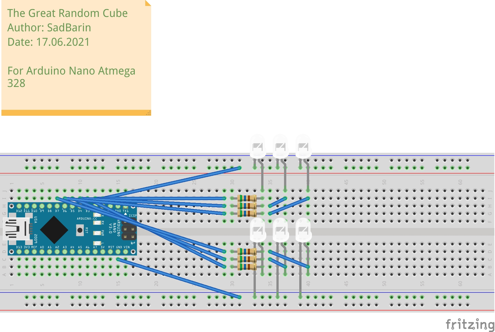

# 🎲 The Great Random Cube 🎲

The dice on the arduino. The power button is responsible for the "throw".  
The project was created for Arduino Nano Atmega 328 using [PlatformIO](https://platformio.org/).

P.S SadBarin my old nickname

